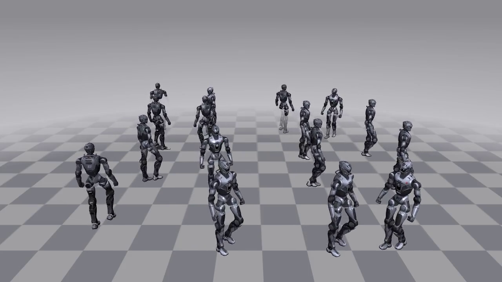
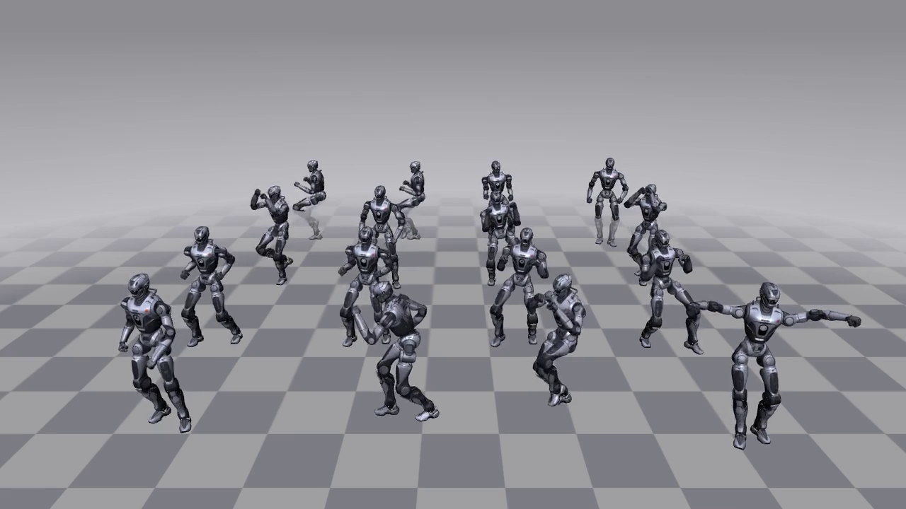
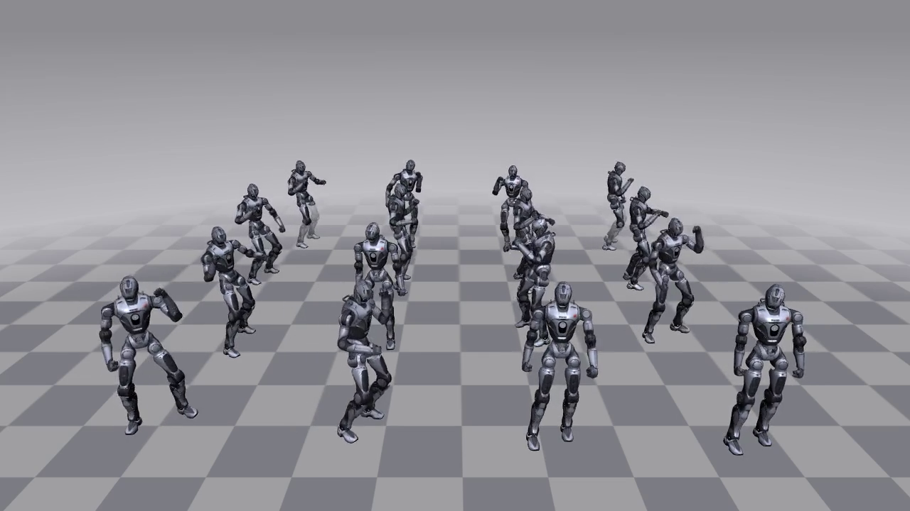

<h1 align="center"> engineai_rl_unilab </h1>

<h3 align="center">
基于 UniLab 包分发的 EngineAI 机器人 RL 训练
</h3>

<p align="center">语言：简体中文 | <a href="README.md">English</a></p>

<p align="center">
  <a href="https://www.apache.org/licenses/LICENSE-2.0"></a>
</p>

|  |  |  |
|:-------------------------------:|:-----------------------------------:|:-----------------------------------:|
|              walk               |               dance1                |               dance2                |

`engineai_rl_unilab` 完全构建在 UniLab 的 PyPI 包分发之上，不依赖 UniLab 源码。
训练、回放、runner/learner/collector 全部来自已发布的 `unilab` wheel；本仓库只
携带任务代码（manager terms）、owner 配置和机器人 XML 资产。

特性包括：

* 两个开箱即用的 T800 25-DoF 任务：walk-flat（Manager-Based PPO / SAC，MuJoCo
  后端；SAC 另有 configured-only 的 mjwarp owner）与 motion tracking（PPO，
  MuJoCo 后端）；
* 任务注册缝（seam）：`UNILAB_EXTRA_REGISTRY_PACKAGES` 环境变量让 UniLab 的
  `ensure_registries()` 导入本仓库的任务包（含 spawn 子进程）；
* 配置组合缝：Hydra `--config-dir` 把 `src/engineai_rl_unilab/conf/<algo>` 追加进
  对应算法 UniLab 训练脚本的 config search path，外部 `task=<task>/<sim>` owner
  YAML 直接参与组合；conf 树按算法分目录（`conf/ppo/`、`conf/sac/`），与 UniLab
  仓内布局一致；
* 全部 T800 资产（XML + mesh/纹理）随仓库分发，开箱即用；`assets.py` 仅作兜底——
  文件缺失时才从 Hugging Face 数据集
  [`unilabsim/unilab-robots`](https://huggingface.co/datasets/unilabsim/unilab-robots)
  补齐（冷路径）。

## 安装

```bash
git clone https://github.com/unilabsim/engineai_rl_unilab.git
cd engineai_rl_unilab
uv sync
```

`unilab==1.1.0` 从生产 PyPI 解析。`uv pip` 用户的等价命令：

```bash
uv pip install "unilab[mujoco]==1.1.0" "unisim-core>=1.1.3,<1.1.5"
```

## 训练

在仓库根目录执行（`env.scene.model_file` 相对仓库根解析）：

```bash
uv run engineai-train --algo ppo --task engineai_t800_walk_flat --sim mujoco
uv run engineai-train --algo sac --task engineai_t800_walk_flat --sim mujoco
```

短程冒烟（4 个 env、2 次迭代、不回放）：

```bash
uv run engineai-train --algo ppo --task engineai_t800_walk_flat --sim mujoco \
  algo.num_envs=4 algo.max_iterations=2 training.no_play=true training.play_env_num=4
```

任意 UniLab Hydra override 均可透传（如 `algo.num_envs=512`、
`training.logger=wandb`）。

## 回放

```bash
uv run engineai-eval --algo ppo --task engineai_t800_walk_flat --sim mujoco --load-run -1
uv run engineai-eval --algo sac --task engineai_t800_walk_flat --sim mujoco --load-run -1
```

## T800 motion tracking

```bash
uv run engineai-train --algo ppo --task engineai_t800_motion_tracking --sim mujoco
uv run engineai-eval --algo ppo --task engineai_t800_motion_tracking --sim mujoco --load-run -1
```

MuJoCo owner 声明 140 维 actor、275 维 critic、25 维动作和逐关节 action scale；
控制频率 50 Hz，每次控制执行 3 个物理子步，episode 上限 500 步，默认 1024 个
环境训练 15000 轮。这是简化基线——不启用 DR events、观测噪声/延迟、动作延迟
或 deadzone——奖励复用 UniLab 的共享 motion terms，不声明与官方 IsaacLab 任务
完全等价。默认动作 `dance1_subject2_t800_first18s_mujoco.npz` 随仓库放在
`assets/motions/t800/`，无需运行时下载。

任务验证及短程训练：

```bash
uv run --with pytest pytest tests/test_t800_motion_tracking.py -q
uv run engineai-train --algo ppo --task engineai_t800_motion_tracking --sim mujoco \
  algo.num_envs=4 algo.max_iterations=2 training.no_play=true training.play_env_num=4
```

这些测试验证配置和 reset/step 契约；训练收敛及实机表现需独立评估。

## 仓库结构

```text
assets/robots/t800/                 # 机器人 XML + mesh/纹理（全部入 git，开箱即用）
src/engineai_rl_unilab/
├── assets.py                       # 冷路径资产物化（snapshot_download）
├── cli.py                          # engineai-train / engineai-eval：env var + --config-dir 注入
├── conf/
│   ├── ppo/task/engineai_t800_walk_flat/
│   │   ├── base.yaml               # PPO 任务声明（obs/action/command/event/termination）
│   │   └── mujoco.yaml             # PPO MuJoCo owner（task_name、algo 超参、sim2sim 契约字段）
│   └── sac/task/engineai_t800_walk_flat/
│       ├── base.yaml               # SAC 任务声明（含 curriculum、SAC 奖励权重）
│       ├── mujoco.yaml             # SAC MuJoCo owner
│       └── mjwarp.yaml             # SAC mjwarp owner（configured-only，关闭 kp/kd DR）
└── tasks/
    ├── __init__.py                 # __unilab_registry_modules__
    └── t800/
        ├── __init__.py             # registry.register_env("EngineAIT800WalkFlat", mujoco/mjwarp)
        └── manager_terms.py        # T800 专属 action/reward terms
```

## License

Apache-2.0.
